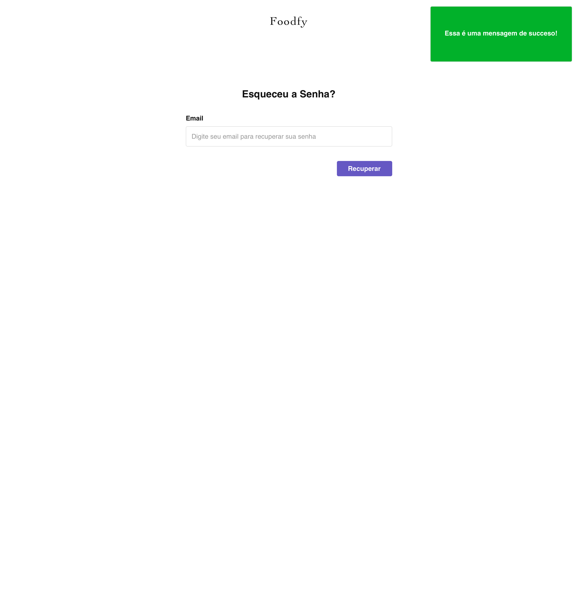
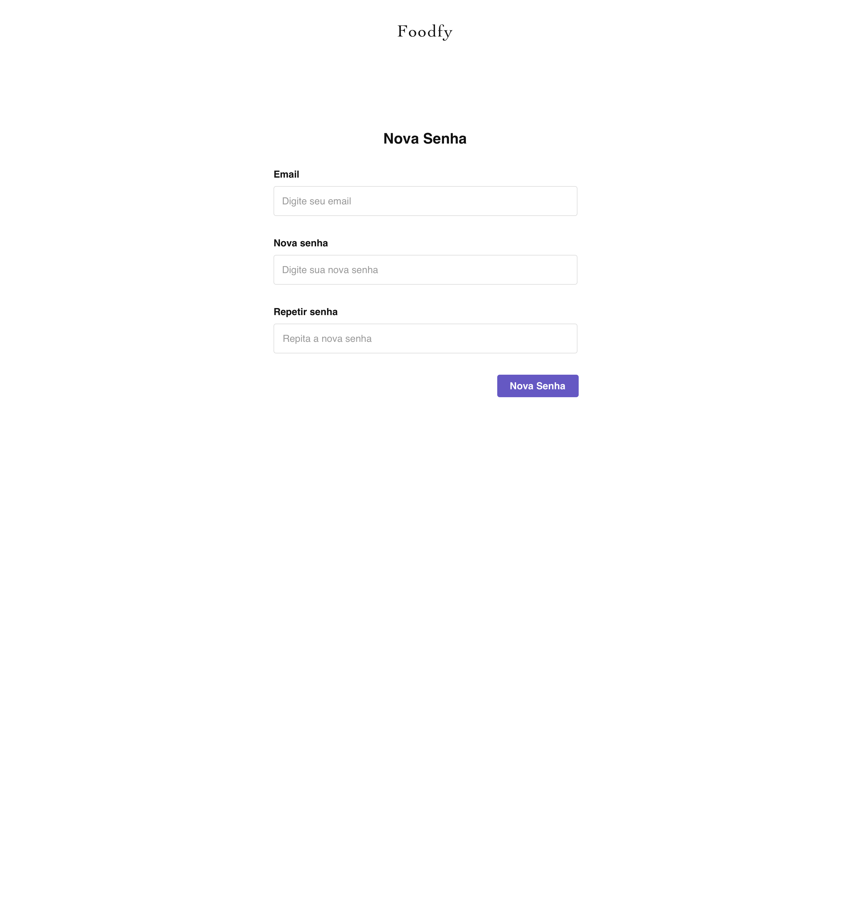
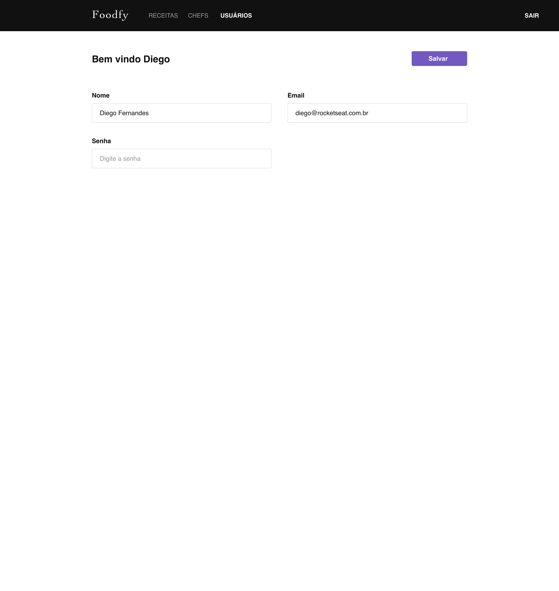
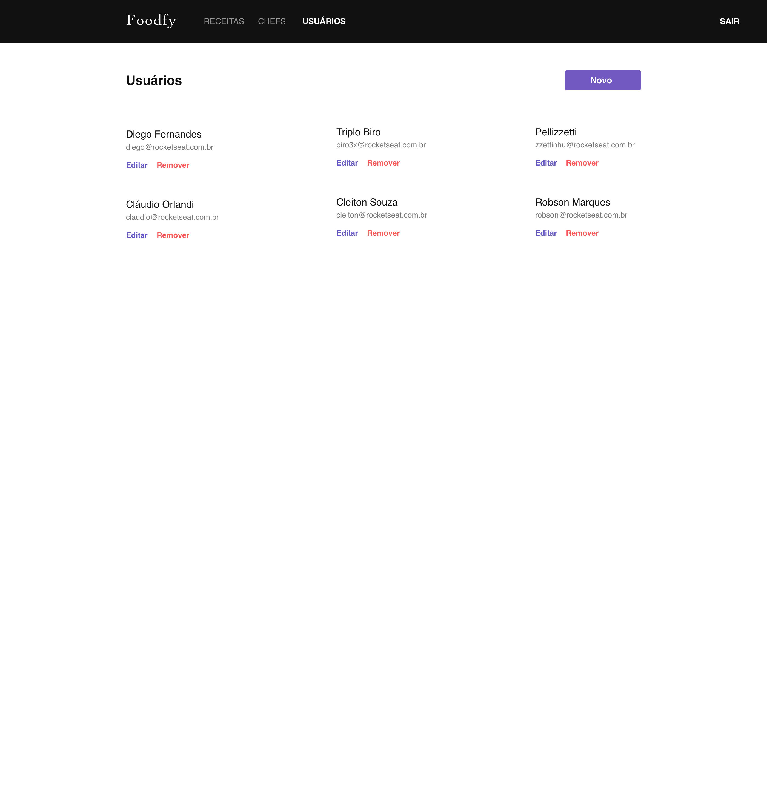
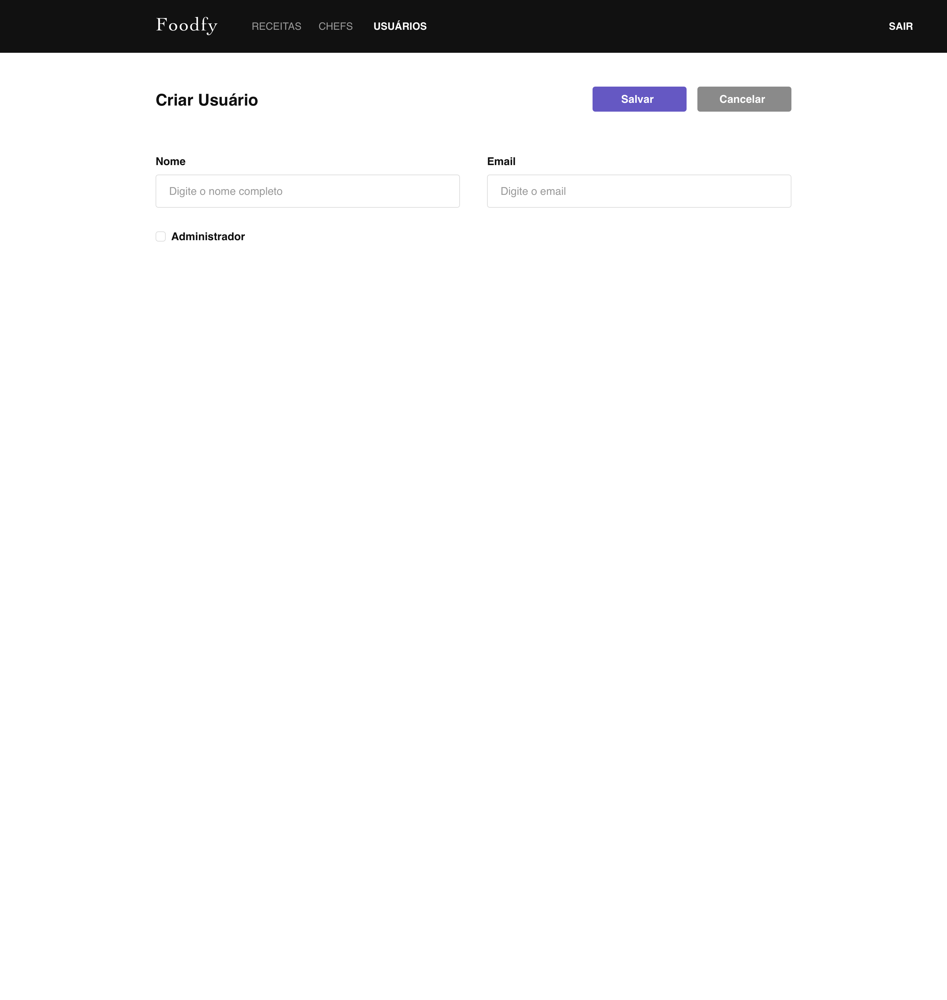
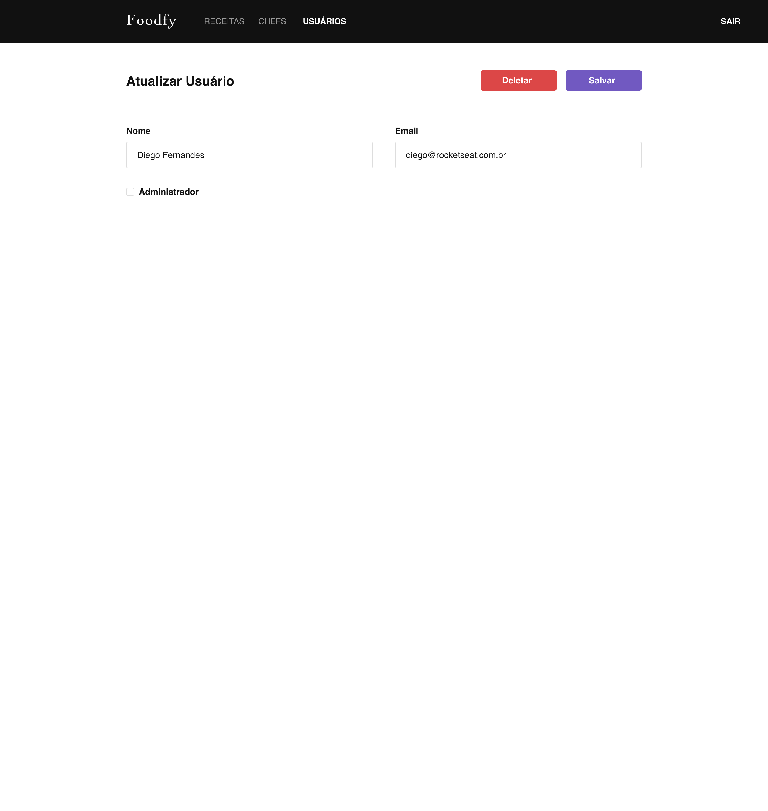
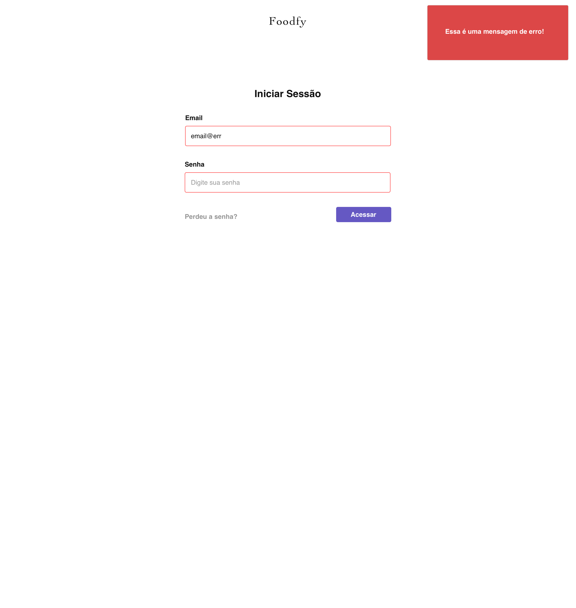

## 🔑 Sistema de Login

Usando os conhecimentos adquiridos até aqui, você deve criar a parte de **autenticação de usuários** no Foodfy, onde **somente os usuários cadastrados**, poderão ter acesso à parte administrativa do sistema.

**Download dos arquivos**: https://github.com/Rocketseat/bootcamp-launchbase-desafios-07/archive/master.zip

## 1. Instruções

- A partir de agora, somente usuários cadastrados poderão ter acesso às rotas `/admin`
- O usuário que tiver o valor de `true` no campo `is_admin` da tabela `users` será considerado o **administrador do sistema** e:
    - Poderá criar/editar/deletar **qualquer** usuário, receita e chef
    - **Somente este** poderá cadastrar/atualizar/deletar os chefs
    - **Somente este** poderá cadastrar outros usuários
    - **Não poderá** deletar sua própria conta
- Um usuário comum **não pode**
    - Editar ou deletar as **receitas** de outro usuário
    - Editar ou deletar outros **usuários**
    - Criar, editar ou deletar **chefs**
    - Deletar sua própria conta.
- **As listagem** de receitas e chefs continuam **acessíveis a todos**, tanto para usuários do sistema como para visitantes do site. (criar uma tela de acesso aberto para ver os chefs do Foodfy)

A partir disso, **cuidado com os botões de acesso** que existem no site e na área administrativa, bem como com as rotas do site. 

Crie uma estrutura de proteção para impedir o acesso a **usuários não autenticados.**

Crie uma estrutura de proteção para impedir que os usuários que estão autenticados**, mas não são administradores**, não tenham permissão de acesso a certas rotas, conforme as instruções acima.

Crie uma estratégia que quando o administrador criar um usuário novo, **o sistema irá criar uma senha** aleatória e enviar por email ao usuário criado. **DICA***: Use a estratégia de criação de TOKEN que você viu nas aulas*.

## 2. Rotas

- Use a estrutura de rotas que você aprendeu nas aulas, para criar as rotas de **entrar e sair do sistema** (login/logout); **solicitação de recuperação** de senha; gerenciamento de **usuários.**
- Coloque as rotas de **perfis de usuário** e **gerenciamento de usuários** da seguinte forma
```js
// Rotas de perfil de um usuário logado
routes.get('/admin/profile', ProfileController.index) // Mostrar o formuláriocom dados do usuário logado
routes.put('/admin/profile', ProfileController.put)// Editar o usuário logado

// Rotas que o administrador irá acessar para gerenciar usuários
routes.get('/admin/users', UserController.list) //Mostrar a lista de usuários cadastrados
routes.post('/admin/users', UserController.post) //Cadastrar um usuário
routes.put('/admin/users', UserController.put) // Editar um usuário
routes.delete('/admin/users', UserController.delete) // Deletar um usuário
```

## 3. Tabelas

Crie uma tabela de nome `users` com os seguintes campos:

- `id SERIAL PRIMARY KEY`
- `name TEXT NOT NULL`
- `email TEXT UNIQUE NOT NULL`
- `password TEXT NOT NULL`
- `reset_token TEXT`
- `reset_token_expires TEXT`
- `is_admin BOOLEAN DEFAULT false`
- `created_at TIMESTAMP DEFAULT(now())`
- `updated_at TIMESTAMP DEFAULT(now())`

ATENÇÃO: Você vai precisar **criar relacionamentos entre usuários e receitas** para cumprir a regra onde o usuário poderá ver a lista de receitas criadas por ele mesmo e somente ele poderá deletar uma receita criada por ele. Portanto, crie uma chave estrangeira `foreign key` de nome `user_id` na tabela de receitas, apontando para o id da receita.

## 4. Sessão de Usuário

Para usar a biblioteca `express-session` que trabalha com sessão e utiliza a configuração `pg_simple`; você vai precisar da tabela abaixo.
```sql
CREATE TABLE "session" (
  "sid" varchar NOT NULL COLLATE "default",
  "sess" json NOT NULL,
  "expire" timestamp(6) NOT NULL
)
WITH (OIDS=FALSE);
ALTER TABLE "session" 
ADD CONSTRAINT "session_pkey" 
PRIMARY KEY ("sid") NOT DEFERRABLE INITIALLY IMMEDIATE;
```
## 5. Telas

O sistema irá ter as seguintes telas

- <a href="#login">Tela de **login**</a>
- Tela de **pedido de recuperação de senha**

    *O sistema irá enviar um email com o link de recuperação*

- <a href="#recovery">Tela de **recuperação de senha**</a>
- <a href="#user">**Tela de informações** do usuário.</a>

    *O usuário deverá preencher sua senha para alterar suas informações* 

- Tela de **listagem de receitas do usuário**

    *Mostrar somente as receitas cadastradas pelo usuário logado*

- <a href="#users">Tela de **listagem/gerenciamento** de usuários do sistema</a>

    **LEMBRE:** *Somente o administrador tem acesso a essa parte do sistema*

**Login**


**Recuperação de Senha**




**Usuário Logado**


**Gerenciamento de Usuários: Listagem**







# 🚨 Alertas e Erros

Você deverá criar uma estratégia de alertas visuais aos usuários.

Esses alertas servirão para comunicar os usuários do sistema sobre possíveis erros ou sucesso, mantendo uma boa comunicação entre o sistema e o usuário.

Exemplo:


## Quando utilizar os alertas?

Na criação, atualização ou remoção uma receita, chef, conta de usuário, bem como login e logout.

Quando falhar, exiba um alerta de erro. 

Caso haja sucesso na transação, exibir alerta de sucesso.

Caso haja algum erro de validação de campos do formulário, sinalizar de forma visual.

# ✉️ Emails

Você deverá criar estratégias de envio de emails para o Foodfy

- Quando um usuário for cadastrado no sistema, ele irá receber um email com o acesso ao sistema.
- Quando um usuário esquecer a senha, e fizer o pedido de recuperação, ele irá receber no email dele um link especial para a página de recuperação de senha.

Sucesso!!